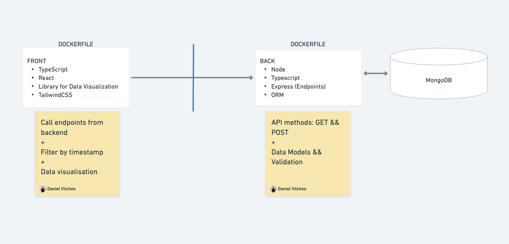
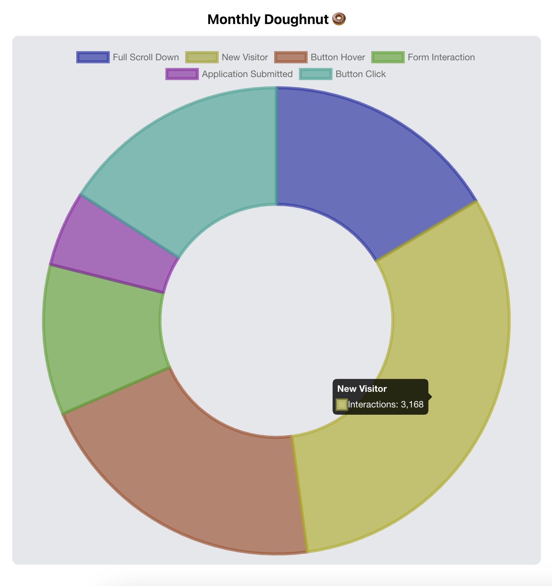
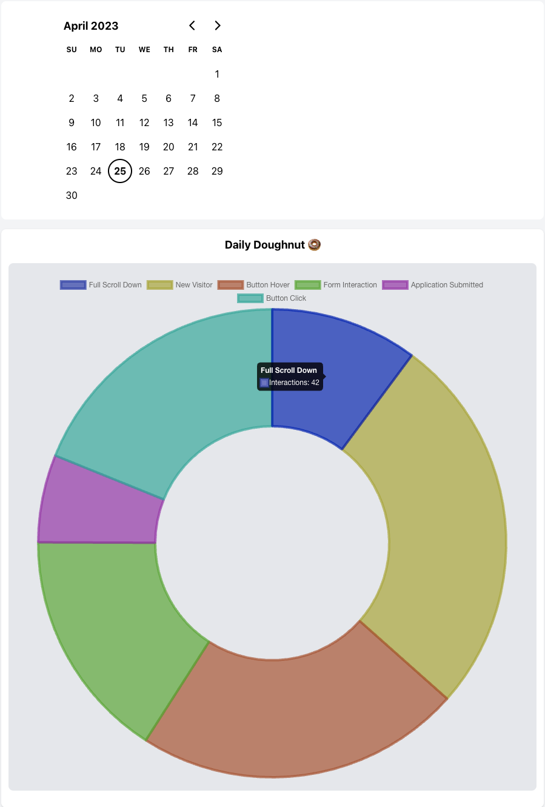
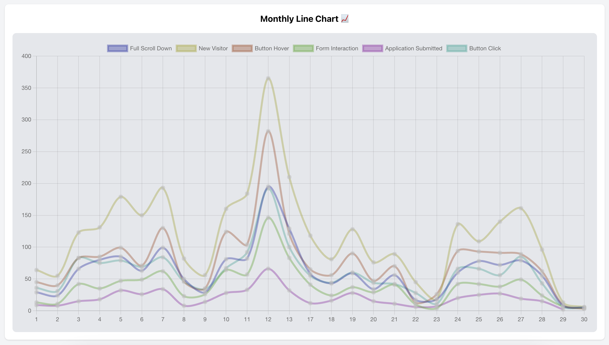
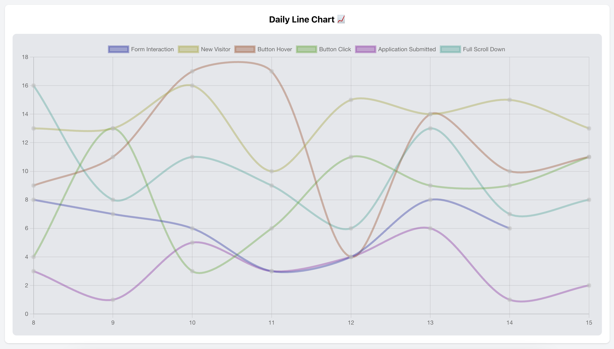

# Metrics Glass

## Summary
Full-stack app, with a built-from-scratch back-end server and a SPA client. The objective of this exercise is to showcase a set of skills: user-centric thinking, technical and coding hard-skills, and an eye for code quality, and UX/UI design. 

The application has been built with a use case in mind: 

I am an employer who has recently been getting low traffic and candidates in some of the open roles of my careers website. I need, hence, to generate a metrics visualisation tool to base my future decisions on data and not just on feelings. 

After doing some research, I've realised that I would like to start off by analizing the impact of doing a LinkedIn post of my highest-prio roles once a week. The final objective is to understand whether it is worth it or not to pay for our LinkedIn Premium subscription. 

Some of the metrics I will be studying are: new visitors, full scroll downs on the target page, apply button hovers, apply button clicks, application form interactions, and application submissions.

After analyzing the gathered data, a tendency is observed. Traffic on the roles that have been published on LinkedIn on a weekly basis increases substantially during the day of posting, and decreases gradually over the following days. This leads to higher conversion numbers from visitors, to end-applicants. 

## Digging deeper

Given that tihs is an invented use-case scenario, an important part of this project has been creating a method that could replicate the expected behaviour to be shown with the cse. A function, available on server/tools/generators.ts uses probability to generate data in ranges both on a weekly basis, and daily basis, depending on whether the day is a posting day, and on whether the peak-hours match with the usual trafic peak-times of the web. Once accomplished, this function is called to generate the data that will populate the collection of my MongoDB.

Once the data is created and stored, it is served to the front view and organised in charts for better visualitsation. For a more dynamic experience, days can be targeted individually to collect more specific data. 

## Technologies Used

-  TypeScript
-  Node.js
-  Express 
-  MongoDB
-  React
-  TailwindCSS
- Chart.js

## Prerequisites
- Docker
- Local ports:
    - 3000
    - 8080

If you don't have Docker installed, you can follow the installation guide [here](https://docs.docker.com/get-docker/).
Plus, make sure to have ports 8080 and 3000 free to use for this project.

## Getting Started

To get started with the project, follow these steps:

1. Clone the repository to your local machine.
2. Use the `.env.sample` file to create your own `.env` file to connect to MongoDB. (If you would rather skip this step, you can contact me directly for my credentials 😉)
3. Navigate to the `server` directory of the project.
4. Run the following command to build the Docker image for the server:
```
$ docker build -t back .
```
4. Once the image is built, run the following command to start the Docker container:
```
$ docker run -p 8080:8080 -it back
```
5. (Optional) Navigate to [http://localhost:8080/api/metrics](http://localhost:8080/api/metrics) in your browser to view the API entries.
6. Navigate to the `client` directory of the project.
7. Run the following command to build the Docker image for the client:
```
$ docker build -t front .
```
7. Once the image is built, run the following command to start the Docker container:
```
$ docker run -p 3000:3000 -it front
```
8. Navigate to [http://localhost:3000](http://localhost:3000) in your browser to view the client side.

## Usage

The application allows users to post metrics to the database and view them in different charts on the frontend. To post a metric, users can send a request via API. If you want to post metrics, make sure to read the following section: API Documentation. Users can also view the metrics and filter them in several charts on the frontend.

Note that, if you run this project from scratch on your machine, it will already have a dataset ready to use in the DB. If you would like to utilize your own dataset, you will need to modify the `.env` file with your own credentials to your MongoDB. You can then use the script sitting on `tools/generator.ts` (/build/tools/generator.js after build). This script will randonly fill the table with "coherent" data for this use case, as explained in the Digging deeper section of this documentation.

## API Documentation

The API has the following endpoints:
- `GET /api/metrics`: Returns all metrics from the database.

Example response body:

    [{"id": "6447c0977d1d92cf6d5864c9",  "timeStamp": "2023-04-10T15:58:25Z", "name": "newVisitor", "value": true}, ...]


- `POST /api/metrics`: Adds a new metric to the database.
  - Parameters:
    - `timeStamp` (string): The time stamp of creation.
    - `name` (string): The name of the metric.
    - `value` (number): The value of the metric.

Example request body:

    [{"timeStamp": "2023-04-10T15:58:25Z", "name": "newVisitor", "value": true}]

## Screenshots

Here are some screenshots of the mindmap I created to define the architecture of the project, as well as some previews of the built client:


*Architecture*


*Monthly doughnut graph*


*Daily doughnut graph*


*Monthly linear chart*


*Daily linear chart*

## License

This project is released under the MIT License. You can view the license [here](LICENSE).
